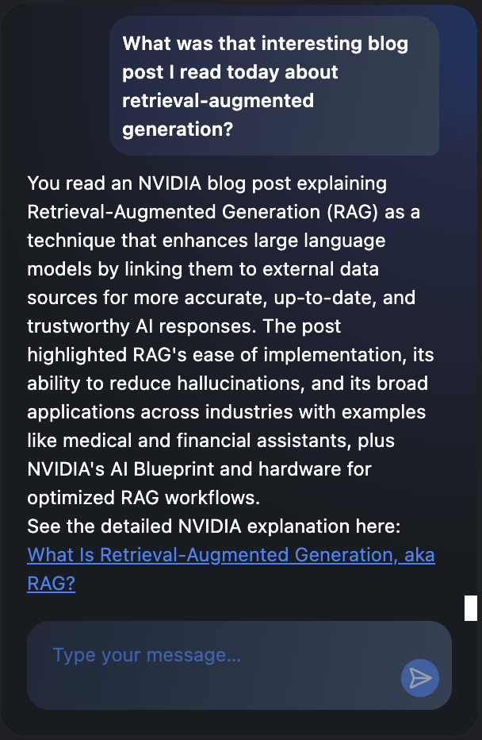
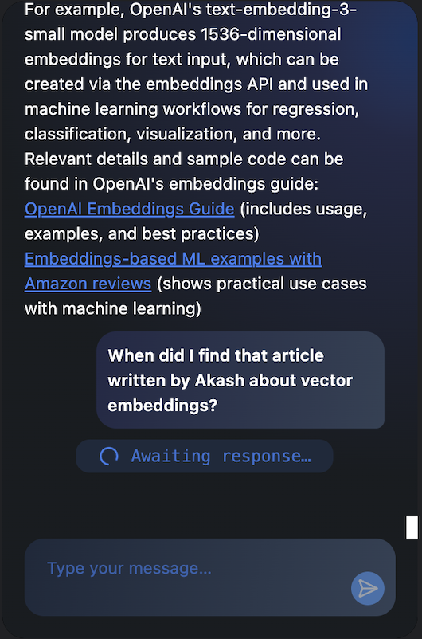

# Browser Brain

Browser Brain is a **privacy-first** Chrome extension that records all the text content you encounter while browsing and lets you query your browsing history using natural language. Unlike most AI-powered tools that send your data to external servers, Browser Brain stores everything locally on your device: your browsing history is indexed in a local vector database (Qdrant) and all chat interactions are managed by a background process running on your machine. You can ask questions about anything you've read and get contextual responses with relevant URLs, powered by an LLM. The only data that ever leaves your device is your query to the OpenAI API, using your own API key.




## Features

- **Privacy-first:** All browsing history, vector storage, and chat history are stored and processed locally—your sensitive data never leaves your device.
- Automatically records and indexes text from every page you visit.
- Stores your browsing history in a local vector database (Qdrant) for efficient, private retrieval.
- Lets you query your history using natural language in a chat interface.
- Returns concise, context-aware answers with relevant sources and clickable links.
- All chat history is synced and accessible in a single chat window, managed locally.
- The only external communication is to the OpenAI API, using your own API key—no other data is sent or shared.

## Technologies Used

- **Chrome Extension APIs** (Manifest V3)
- **React + Typescript** (frontend)
- **ShadCN + Tailwind CSS** (components and styling)
- **Vite** (frontend build tooling)
- **FastAPI** (Python backend server)
- **Qdrant** (vector database for semantic search)
- **OpenAI API** (LLM for natural language responses)
- **uv** (Python dependency management and environment setup)

## Requirements

- **Apple Silicon Mac** (M1/M2/M3): The included Qdrant binary is built for Apple Silicon. Other platforms are not officially supported.
    - If you want to try on another platform, you can replace the Qdrant binary in bin with one from [Qdrant's release page](https://github.com/qdrant/qdrant/releases), but this has not been tested.

## Installation

### 1. Clone the Repository

```sh
git clone https://github.com/yourusername/browser-brain.git
cd browser-brain
```

### 2. Set Up the Backend

The backend uses [uv](https://github.com/charliermarsh/uv) for Python package management.  
If you don't have `uv` installed, you can install it by following the instructions on the [uv installation page](https://docs.astral.sh/uv/getting-started/installation/).

Then, install dependencies:

```sh
cd backend
uv sync
```

### 3. Configure and Start the Backend

Run the setup script with your OpenAI API key:

```sh
python3 src/setup.py <your_openai_api_key>
```

This will create a `.env` file and set up the backend as a launch agent on your Mac.

### 4. Build and Load the Chrome Extension

- Build the extension (if needed) in the web-extension folder.
- In Chrome, go to `chrome://extensions`, enable "Developer mode", and click "Load unpacked".
- Select the `dist` folder inside web-extension.

## Usage

- Once installed, the extension will automatically record text from pages you visit.
- Open the extension popup to access your chat history and ask questions about your browsing.
- The extension will return concise answers, citing relevant sources with clickable links.

## Notes

- Only Apple Silicon Macs are officially supported due to the Qdrant binary.
- You may be able to run on other platforms by replacing the Qdrant binary, but this is not guaranteed.
- All data is stored locally; your browsing history is not sent to any external server except for OpenAI API calls.

## Development

### Web Extension

- Install dependencies with:
  ```sh
  cd web-extension
  npm install
  ```
- Build the extension with:
  ```sh
  npm run build
  ```
- After making changes, reload the extension in Chrome (`chrome://extensions`) to see updates.

### Backend

- To run the backend locally for development, first stop the background launch agent:
  ```sh
  cd backend
  python3 src/unsetup.py
  ```
- Then start the backend manually:
  ```sh
  uv run src/main.py
  ```
- This allows you to see logs and debug the backend interactively.